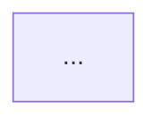

# OpenGrep 与代码业务 DAG Skill 迁移清单

本文档整理从当前 DeerFlow 仓库迁移以下两个 skill 到一个全新 DeerFlow 仓库时，需要移动的文件、目录和环境依赖：

- `opengrep-compliance`
- `code-business-dag-analysis-pipeline`

下文中的路径均以 DeerFlow 仓库根目录为起点。

## 总体原则

迁移时优先复制源码、规则、配置和文档，不复制 Python 运行缓存。

必须复制：

- `SKILL.md`
- skill 的脚本文件
- skill 运行时读取的配置、规则、本体文件
- skill 显式依赖的其他 skill
- 后端 `deerflow.pipeline` 实现

不建议复制：

- `__pycache__/`
- `*.pyc`
- 临时输出目录，例如 `reports/`、`outputs/`、`.tmp/`
- 本地测试运行产生的中间文件

## 1. opengrep-compliance

### 1.1 必须复制的目录

完整复制以下目录到新 DeerFlow 的相同位置：

```text
skills/custom/program_snippet/opengrep-compliance/
```

这是最稳妥的迁移方式，因为该 skill 同时包含说明文件、runner、规则库和离线 OpenGrep 二进制。

### 1.2 核心文件清单

如果不能整体复制目录，至少需要复制以下文件和目录：

```text
skills/custom/program_snippet/opengrep-compliance/SKILL.md
skills/custom/program_snippet/opengrep-compliance/README.md
skills/custom/program_snippet/opengrep-compliance/scripts/run_scan.py
skills/custom/program_snippet/opengrep-compliance/rules/
skills/custom/program_snippet/opengrep-compliance/vendor/opengrep/
```

其中 `rules/` 和 `vendor/opengrep/` 是运行扫描的关键资产，缺任何一个都无法完成离线扫描。

### 1.3 规则文件

必须迁移：

```text
skills/custom/program_snippet/opengrep-compliance/rules/baseline-compliance.yaml
skills/custom/program_snippet/opengrep-compliance/rules/README.md
skills/custom/program_snippet/opengrep-compliance/rules/official/opengrep-rules/
skills/custom/program_snippet/opengrep-compliance/rules/community/trailofbits-semgrep-rules/
skills/custom/program_snippet/opengrep-compliance/rules/community/apiiro-malicious-code-ruleset/
```

这些目录包含本地规则库。`run_scan.py` 会在扫描前过滤 `.yaml` 和 `.yml` 文件，只加载包含顶层 `rules:` 的运行时规则配置。

### 1.4 OpenGrep 二进制文件

当前仓库内置的是 Linux 版 OpenGrep：

```text
skills/custom/program_snippet/opengrep-compliance/vendor/opengrep/linux/opengrep
skills/custom/program_snippet/opengrep-compliance/vendor/opengrep/linux/opengrep.cert
skills/custom/program_snippet/opengrep-compliance/vendor/opengrep/linux/opengrep.sig
```

如果新 DeerFlow 的运行环境是 Linux，复制这些文件即可。迁移后需要确认：

```bash
chmod +x skills/custom/program_snippet/opengrep-compliance/vendor/opengrep/linux/opengrep
```

如果新环境是 Windows 原生运行，需要额外准备：

```text
skills/custom/program_snippet/opengrep-compliance/vendor/opengrep/windows/opengrep.exe
```

如果新环境是 macOS，需要额外准备：

```text
skills/custom/program_snippet/opengrep-compliance/vendor/opengrep/darwin/opengrep
```

也可以在运行 `run_scan.py` 时通过 `--binary` 显式指定 OpenGrep 可执行文件路径。

### 1.5 可选复制的下载脚本和说明

如果希望在新仓库重新下载 OpenGrep 二进制和规则，而不是直接复制当前离线资产，可以复制以下文件：

```text
tools/opengrep/download-opengrep-assets.sh
docs/opengrep-offline-downloads.md
```

当前文档还提到了两个社区规则下载脚本：

```text
tools/opengrep/download-trailofbits-rules.sh
tools/opengrep/download-apiiro-rules.sh
```

迁移前需要确认源仓库中是否存在这两个脚本。如果不存在，就直接复制当前已经整理好的 `rules/community/` 目录。

### 1.6 不需要复制的文件

```text
skills/custom/program_snippet/opengrep-compliance/scripts/__pycache__/
skills/custom/program_snippet/opengrep-compliance/scripts/*.pyc
reports/opengrep/
outputs/
.tmp/opengrep-downloads/
```

### 1.7 环境要求

运行扫描时需要：

- Python 3
- 本地 OpenGrep 二进制
- 本地规则目录 `skills/custom/program_snippet/opengrep-compliance/rules/`
- 无需网络

准备资产时才需要：

- 网络访问 GitHub
- `bash`
- `curl`
- `unzip`

### 1.8 迁移后验证

在 Linux 环境中先验证二进制：

```bash
skills/custom/program_snippet/opengrep-compliance/vendor/opengrep/linux/opengrep --version
```

再验证 runner：

```bash
python skills/custom/program_snippet/opengrep-compliance/scripts/run_scan.py \
  --target . \
  --output-dir reports/opengrep-smoke
```

验证成功后应生成：

```text
reports/opengrep-smoke/opengrep.json
reports/opengrep-smoke/opengrep.sarif
reports/opengrep-smoke/summary.json
reports/opengrep-smoke/report.md
reports/opengrep-smoke/rule-report.md
reports/opengrep-smoke/llm-analysis-template.md
```

## 2. code-business-dag-analysis-pipeline

### 2.1 必须复制的主 skill 目录

完整复制：

```text
skills/custom/program_snippet/code-business-dag-analysis-pipeline/
```

核心文件包括：

```text
skills/custom/program_snippet/code-business-dag-analysis-pipeline/SKILL.md
skills/custom/program_snippet/code-business-dag-analysis-pipeline/README_zh.md
skills/custom/program_snippet/code-business-dag-analysis-pipeline/scripts/run_pipeline.py
skills/custom/program_snippet/code-business-dag-analysis-pipeline/scripts/render_report.py
skills/custom/program_snippet/code-business-dag-analysis-pipeline/evals/evals.json
skills/custom/program_snippet/code-business-dag-analysis-pipeline/evals/fixtures/
```

其中 `run_pipeline.py` 是完整流水线入口，`render_report.py` 用于把 JSON 分析结果渲染为中文 Markdown 报告。

### 2.2 必须同时复制的依赖 skill

`code-business-dag-analysis-pipeline` 是编排型 skill，它依赖多个上游 skill。必须同时复制以下目录：

```text
skills/custom/program_snippet/code-to-ast-new/
skills/custom/program_snippet/code-splitter-adapter/
skills/custom/program_snippet/dataflow-extractor/
skills/custom/program_snippet/code-semantic-labeler/
skills/custom/program_snippet/pipeline-graph-builder/
skills/custom/program_snippet/pipeline-reasoner/
```

这些目录不能只复制 `SKILL.md`，因为 pipeline 会直接 import 它们内部的 Python 文件。

### 2.3 依赖 skill 的关键文件

`code-to-ast-new` 至少需要：

```text
skills/custom/program_snippet/code-to-ast-new/SKILL.md
skills/custom/program_snippet/code-to-ast-new/README.md
skills/custom/program_snippet/code-to-ast-new/scripts/convert.py
```

`code-splitter-adapter` 至少需要：

```text
skills/custom/program_snippet/code-splitter-adapter/SKILL.md
skills/custom/program_snippet/code-splitter-adapter/README.md
skills/custom/program_snippet/code-splitter-adapter/code_splitter.py
skills/custom/program_snippet/code-splitter-adapter/scripts/split.py
```

`dataflow-extractor` 至少需要：

```text
skills/custom/program_snippet/dataflow-extractor/SKILL.md
skills/custom/program_snippet/dataflow-extractor/README.md
skills/custom/program_snippet/dataflow-extractor/dataflow_extractor.py
skills/custom/program_snippet/dataflow-extractor/scripts/extract.py
```

`code-semantic-labeler` 至少需要：

```text
skills/custom/program_snippet/code-semantic-labeler/SKILL.md
skills/custom/program_snippet/code-semantic-labeler/README.md
skills/custom/program_snippet/code-semantic-labeler/semantic_labeler.py
skills/custom/program_snippet/code-semantic-labeler/ontology_rules.json
skills/custom/program_snippet/code-semantic-labeler/scripts/label.py
```

`pipeline-graph-builder` 至少需要：

```text
skills/custom/program_snippet/pipeline-graph-builder/SKILL.md
skills/custom/program_snippet/pipeline-graph-builder/agents/openai.yaml
```

`pipeline-reasoner` 至少需要：

```text
skills/custom/program_snippet/pipeline-reasoner/SKILL.md
```

建议直接复制这些依赖 skill 的完整目录，避免漏掉 README、评测样例或未来新增的规则文件。

### 2.4 必须复制或确认存在的后端模块

`run_pipeline.py` 会把下面的路径加入 `sys.path`：

```text
backend/packages/harness/
```

然后导入：

```python
from deerflow.pipeline import CloudLLMReasoner, PipelineGraphBuilder
```

因此新 DeerFlow 中必须存在以下后端模块：

```text
backend/packages/harness/deerflow/pipeline/__init__.py
backend/packages/harness/deerflow/pipeline/graph_builder.py
backend/packages/harness/deerflow/pipeline/reasoner.py
backend/packages/harness/deerflow/pipeline/orchestrator.py
backend/packages/harness/deerflow/pipeline/code_processing_pipeline.py
backend/packages/harness/deerflow/pipeline/component_packager.py
```

如果新 DeerFlow 已经有 `deerflow.pipeline` 包，需要确认它导出了：

```text
PipelineGraphBuilder
CloudLLMReasoner
DeerFlowOrchestrator
```

最低运行 `code-business-dag-analysis-pipeline/scripts/run_pipeline.py` 时，必须有 `PipelineGraphBuilder` 和 `CloudLLMReasoner`。

### 2.5 后端依赖声明

需要确认新仓库中存在或合并以下依赖声明：

```text
backend/packages/harness/pyproject.toml
backend/pyproject.toml
backend/uv.lock
```

最关键的 Python 依赖是：

```text
networkx>=3.4.0
```

推荐同时具备：

```text
langchain-text-splitters
```

如果缺少 `langchain-text-splitters`，当前 pipeline 会在代码切分阶段降级为单 chunk，但分析质量会下降。

可选依赖：

```text
llama-index
esprima
tree-sitter
tree-sitter-cpp
```

这些主要用于其他语言或其他 splitter 策略。当前 `code-business-dag-analysis-pipeline` 只面向 Python，Python AST 解析主要依赖标准库 `ast`。

### 2.6 不需要复制的文件

```text
skills/custom/program_snippet/code-business-dag-analysis-pipeline/scripts/__pycache__/
skills/custom/program_snippet/code-business-dag-analysis-pipeline/scripts/*.pyc
skills/custom/program_snippet/code-to-ast-new/scripts/__pycache__/
skills/custom/program_snippet/code-splitter-adapter/__pycache__/
skills/custom/program_snippet/code-splitter-adapter/scripts/__pycache__/
skills/custom/program_snippet/dataflow-extractor/__pycache__/
skills/custom/program_snippet/dataflow-extractor/scripts/__pycache__/
skills/custom/program_snippet/code-semantic-labeler/__pycache__/
skills/custom/program_snippet/code-semantic-labeler/scripts/__pycache__/
backend/packages/harness/deerflow/pipeline/__pycache__/
```

### 2.7 迁移后验证

先验证报告渲染脚本可用：

```powershell
python skills\custom\program_snippet\code-business-dag-analysis-pipeline\scripts\render_report.py --help
```

再准备一个很小的 Python 文件，例如包含 `cv2.VideoCapture`、`model.predict`、`tracker.update`、`save_tracks` 的脚本，然后运行：

```powershell
python skills\custom\program_snippet\code-business-dag-analysis-pipeline\scripts\run_pipeline.py `
  --file path\to\input.py `
  --output outputs\code_business_dag_result.json `
  --report-output outputs\code_business_dag_report.md
```

验证成功后应生成：

```text
outputs/code_business_dag_result.json
outputs/code_business_dag_report.md
```

JSON 中应包含：

```text
status
language
steps
chunks
calls
dataflow
labeled_nodes
pipeline
diagnosis
report_path
report_format
```

Markdown 报告中应包含 Mermaid 图：

````text

````

## 3. 推荐迁移文件清单

如果目标是完整复刻当前能力，推荐一次性迁移以下路径：

```text
skills/custom/program_snippet/opengrep-compliance/
skills/custom/program_snippet/code-business-dag-analysis-pipeline/
skills/custom/program_snippet/code-to-ast-new/
skills/custom/program_snippet/code-splitter-adapter/
skills/custom/program_snippet/dataflow-extractor/
skills/custom/program_snippet/code-semantic-labeler/
skills/custom/program_snippet/pipeline-graph-builder/
skills/custom/program_snippet/pipeline-reasoner/
backend/packages/harness/deerflow/pipeline/
backend/packages/harness/pyproject.toml
backend/pyproject.toml
docs/opengrep-offline-downloads.md
tools/opengrep/download-opengrep-assets.sh
```

如果新仓库已经完整包含 `backend/packages/harness` 和正确的依赖声明，则只需要确认 `deerflow.pipeline` 的接口兼容，不必覆盖整个后端。

## 4. 迁移验收清单

迁移完成后逐项确认：

- `skills/custom/program_snippet/opengrep-compliance/SKILL.md` 存在。
- `skills/custom/program_snippet/opengrep-compliance/scripts/run_scan.py` 存在。
- `skills/custom/program_snippet/opengrep-compliance/rules/` 存在且包含规则 YAML。
- Linux 环境下 `skills/custom/program_snippet/opengrep-compliance/vendor/opengrep/linux/opengrep` 存在且可执行。
- `skills/custom/program_snippet/code-business-dag-analysis-pipeline/SKILL.md` 存在。
- `skills/custom/program_snippet/code-business-dag-analysis-pipeline/scripts/run_pipeline.py` 存在。
- 6 个依赖 skill 目录均存在。
- `skills/custom/program_snippet/code-semantic-labeler/ontology_rules.json` 存在。
- `backend/packages/harness/deerflow/pipeline/graph_builder.py` 存在。
- `backend/packages/harness/deerflow/pipeline/reasoner.py` 存在。
- Python 环境中可以 import `networkx`。
- Python 环境中可以 import `deerflow.pipeline`。
- OpenGrep runner 能生成 `summary.json` 和 `rule-report.md`。
- DAG pipeline 能生成 JSON 和 Markdown 报告。

## 5. 常见问题

### OpenGrep 提示找不到二进制

检查当前操作系统对应路径是否存在：

```text
Linux:   skills/custom/program_snippet/opengrep-compliance/vendor/opengrep/linux/opengrep
Windows: skills/custom/program_snippet/opengrep-compliance/vendor/opengrep/windows/opengrep.exe
macOS:   skills/custom/program_snippet/opengrep-compliance/vendor/opengrep/darwin/opengrep
```

如果路径不同，运行时使用 `--binary` 指定。

### OpenGrep 提示没有规则

检查：

```text
skills/custom/program_snippet/opengrep-compliance/rules/
```

目录下必须有 `.yaml` 或 `.yml` 文件，并且规则文件需要包含顶层 `rules:`。

### DAG pipeline 找不到 deerflow.pipeline

检查：

```text
backend/packages/harness/deerflow/pipeline/
```

并确认运行脚本时位于 DeerFlow 仓库结构内。当前 `run_pipeline.py` 通过相对路径推导仓库根目录，如果新仓库目录层级发生变化，需要同步调整脚本里的 `_repo_root()`。

### 代码切分降级为单 chunk

通常是缺少：

```text
langchain-text-splitters
```

安装后重新运行 pipeline 即可获得更好的 chunk 结果。
