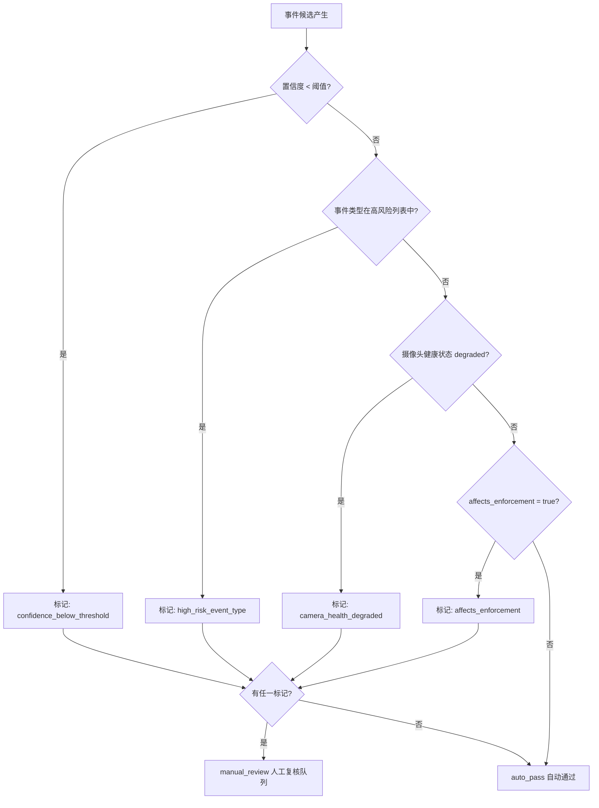

基于 `human-review-routing` 技能的路由逻辑和视频监控业务规范，以下是**必须进入人工复核的事件结果分类规则**：

---

## 一、四大强制触发条件

| 触发条件 | 判定标准 | 路由原因标签 |
|---------|---------|------------|
| **置信度低于阈值** | `confidence < review_threshold`（默认 0.85） | `confidence_below_threshold` |
| **高风险事件类型** | `event_type` 命中 `high_risk_event_types` 配置列表 | `high_risk_event_type` |
| **摄像头画面降级/遮挡** | `camera_health_status == "degraded"`（含遮挡、模糊、冻结、离线等） | `camera_health_degraded` |
| **涉及执法影响** | `affects_enforcement == true` | `affects_enforcement` |

**任一条件成立即强制进入 `manual_review` 队列；全部不满足则走 `auto_pass`。**

---

## 二、各场景详细说明

### 1. 事件置信度低

- **量化阈值**：默认 `0.85`，可通过 `review_thresholds` 按事件类型自定义
- **适用情况**：LLM 审帧后给出的事件置信度评分落在区间 `[threshold - 0.1, threshold)` 时，系统不会自动放行，而是送入人工复核队列等待确认
- **典型场景**：烟雾/火焰识别中仅有局部疑似区域、摔倒检测中人物姿态不够典型

### 2. 摄像头画面有遮挡或画质降级

- **覆盖状态**：`degraded` 包括以下子状态——
  - 画面被树叶、广告牌等物理遮挡
  - 镜头模糊、结霜、污损
  - 视频流冻结、卡顿
  - 摄像头离线但仍有残留告警
  - ROI 区域偏移导致监控目标不在视野内
- **处理逻辑**：只要相机健康检查返回 `degraded`，无论事件置信度高低，一律进入人工复核

### 3. 涉及执法类事件

- **判定标志**：事件的 `affects_enforcement` 字段标记为 `true`
- **典型执法关联类型**：
  - 违章停车 / 占道经营
  - 闯红灯 / 逆行 / 占用应急车道
  - 非法入侵 / 破坏公物
  - 交通肇事逃逸
  - 其他可能作为行政处罚或诉讼证据的事件
- **合规要求**：涉及执法证据的事件必须经过人工二次确认，确保电子证据链完整有效

---

## 三、路由决策流程图



---

## 四、输出数据结构

每个事件的复核路由结果包含：

```json
{
  "event_id": "evt_xxx",
  "review_required": true,
  "reasons": ["confidence_below_threshold", "camera_health_degraded"],
  "review_threshold": 0.85,
  "queue": "manual_review"
}
```

---

**总结**：当且仅当事件同时满足「置信度达标 + 非高风险类型 + 摄像头健康正常 + 不涉及执法」四个条件时，才会走自动通过流程。其余所有情形都必须进入人工复核队列，这是视频监控系统中保障误报拦截率和证据合法性的核心策略。