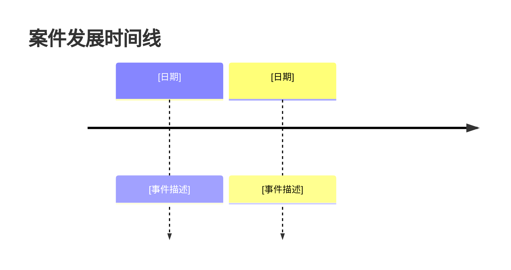

# 案件分析摘要模板

## 输出结构

```markdown
# 案件分析摘要

**生成时间**：[YYYY-MM-DD HH:MM]
**分析材料**：[列出分析的文件名]
**案件类型**：[民事/刑事/行政]

---

## 一、案件基本信息

### 案件性质

- **案件类型**：[民事/刑事/行政]
- **案由**：[具体案由，如合同纠纷、软件著作权侵权]
- **管辖**：[法院/机关名称]
- **案件标的**：[金额或具体标的]

### 当事人信息

- **原告/申请人**：[姓名/名称、基本信息]
- **被告/被申请人**：[姓名/名称、基本信息]
- **第三人**：[如有]

### 案件现状

- **当前阶段**：[咨询/起诉/审理/执行]
- **重要时间节点**：[立案时间、开庭时间等]
- **当前进展**：[简要说明]

---

## 二、事实脉络

### 时间线



### 关键事件

1. **[事件一]**：[详细描述，包括时间、地点、人物、经过]
2. **[事件二]**：[详细描述，包括时间、地点、人物、经过]
3. **[事件三]**：[详细描述，包括时间、地点、人物、经过]

### 事实经过

[使用段落式描述，按逻辑顺序组织案件的完整经过]

---

## 三、法律关系

### 合同关系

[描述合同主体、合同内容、合同履行情况、违约情况等。如无合同关系则删除本节]

### 侵权关系

[描述侵权行为、损害结果、因果关系、主观过错等。如无侵权关系则删除本节]

### 其他法律关系

[描述其他类型的法律关系，如婚姻、继承、劳动等。如无则删除本节]

---

## 四、争议焦点

### 主要争议点

1. **[争议点一]**
   - **事实层面**：[描述需要查明的事实]
   - **法律层面**：[描述需要解决的法律问题]

2. **[争议点二]**
   - **事实层面**：[描述需要查明的事实]
   - **法律层面**：[描述需要解决的法律问题]

### 争议分类

- **事实争议**：[列出需要查明的事实问题]
- **法律争议**：[列出需要解决的法律问题]

### 争议层级

- **核心争议**：[决定案件结果的主要争议]
- **次要争议**：[其他相关争议]

---

## 五、证据材料

### 已有证据

| 证据名称 | 证明目的 | 证明力评估 | 备注 |
|---------|---------|-----------|------|
| [证据一] | [证明什么] | [强/中/弱] | [说明] |
| [证据二] | [证明什么] | [强/中/弱] | [说明] |

### 缺失证据

- **[缺失证据一]**：[说明为何需要，如何获取]
- **[缺失证据二]**：[说明为何需要，如何获取]

### 证据收集建议

1. [建议一]
2. [建议二]

---

## 六、关键法律问题

### 程序问题

- **[问题一]**：[描述问题及影响]
- **[问题二]**：[描述问题及影响]

### 实体问题

- **[问题一]**：[描述问题及法律依据]
- **[问题二]**：[描述问题及法律依据]

### 风险提示

**[风险一]**：[描述风险及应对建议]
**[风险二]**：[描述风险及应对建议]

---

## 七、待确认信息

以下信息需要进一步确认：

- **[待确认信息一]**：[说明为何需要确认]
- **[待确认信息二]**：[说明为何需要确认]

---

*本分析基于现有材料生成，仅供参考。具体法律问题请咨询专业律师。*

**分析完成时间**：[YYYY-MM-DD HH:MM]
**分析材料数量**：[X] 个文件
```

## 特殊模块：信息提取规则

- **缺失信息**：用「[待确认]」标注，不得编造
- **信息冲突**：保留冲突点并标注来源/位置
- **不确定信息**：一律标注为「[待确认]」

## 特殊模块：证据证明力评估标准

- **强**：公文书证、原始证据、直接证据
- **中**：私文书证、传来证据、间接证据
- **弱**：单一证据、传闻证据、补强证据

## 特殊模块：可视化说明

- 时间线部分使用 Mermaid timeline 图表
- 如用户不需要可视化，可跳过 Mermaid 图表，改用纯文本列表
```
</suggestion>
