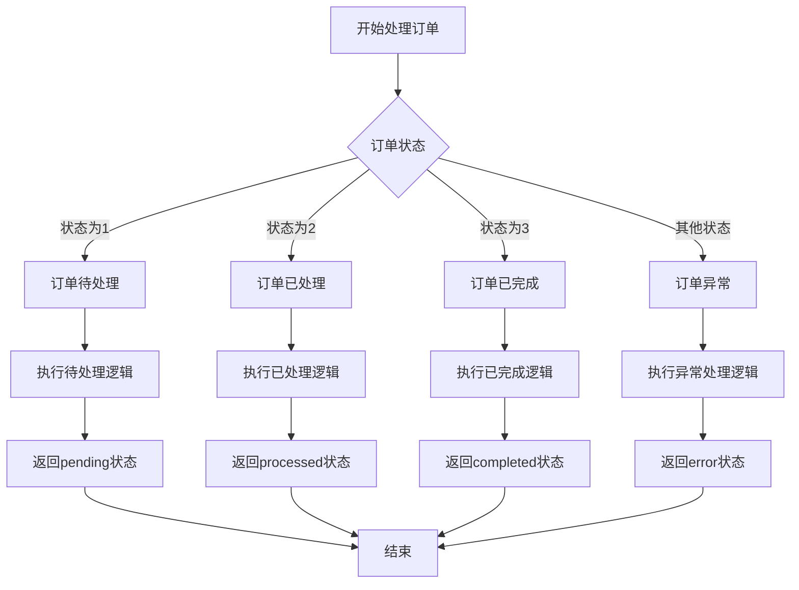

# 业务流程可视化器技能

一个将包含复杂业务逻辑的代码片段转换为业务流程图的 DeerFlow 技能。

## 功能

- **代码分析**：分析包含复杂业务逻辑的代码片段
- **业务流程提取**：提取代码中的业务流程和决策点
- **可视化转换**：将业务流程转换为 Mermaid 流程图
- **非技术语言**：使用非技术语言描述业务流程
- **Markdown 输出**：以 Markdown 格式输出包含 Mermaid 图表的报告

## 使用方法

### 基本使用

```bash
# 分析代码片段
python scripts/render.py --code "def process_order(status):\n    if status == 1:\n        print('订单待处理')\n    elif status == 2:\n        print('订单已处理')\n    else:\n        print('订单异常')"

# 分析代码文件
python scripts/render.py --file input.py --output flowchart.md
```

### 参数

| 参数 | 是否必需 | 描述 |
|------|----------|------|
| `--code` | 要么 `--code` 要么 `--file` | 包含业务逻辑的代码片段 |
| `--file` | 要么 `--code` 要么 `--file` | 包含业务逻辑的代码文件路径 |
| `--output` | 否 | 保存输出结果的路径 |

## 示例

### 订单处理流程示例

**输入：**
```python
def process_order(status):
    if status == 1:
        print('订单待处理')
        # 执行待处理逻辑
        return 'pending'
    elif status == 2:
        print('订单已处理')
        # 执行已处理逻辑
        return 'processed'
    elif status == 3:
        print('订单已完成')
        # 执行已完成逻辑
        return 'completed'
    else:
        print('订单异常')
        # 执行异常处理逻辑
        return 'error'
```

**输出：**
```markdown
# 业务流程可视化报告

## 流程图



## 流程说明

此流程图展示了订单处理的业务流程，包含以下步骤：
1. 开始处理订单
2. 根据订单状态进行决策：
   - 状态为1：订单待处理，执行待处理逻辑，返回pending状态
   - 状态为2：订单已处理，执行已处理逻辑，返回processed状态
   - 状态为3：订单已完成，执行已完成逻辑，返回completed状态
   - 其他状态：订单异常，执行异常处理逻辑，返回error状态
3. 结束流程

## 注意事项

- 此流程图基于代码中的业务逻辑生成
- 流程图使用 Mermaid 语法，可以在支持 Mermaid 的 Markdown 编辑器中查看
- 流程中的决策点和步骤已转换为非技术语言，便于业务人员理解
```

## 依赖

- Python 3.7+
- langchain_core
- 一个初始化好的聊天模型实例（如 ChatOpenAI）

## 安装依赖

```bash
pip install langchain-core
# 如果使用 OpenAI 模型
pip install langchain-openai
```

## 集成到 DeerFlow

1. 确保 `llm` 实例已在外部初始化
2. 将 `business_flow_renderer_tool` 工具添加到 DeerFlow 的工具列表中
3. 当用户请求分析业务流程时，DeerFlow 会自动调用此工具

## 注意事项

- 业务流程提取的质量取决于代码的复杂度和清晰度
- 非常大的代码文件可能需要更长的处理时间
- 对于过于复杂的代码，生成的流程图可能会比较复杂
- 对于最佳结果，提供结构清晰、逻辑明确的代码
- 此技能依赖于大模型的能力，可能会因模型不同而产生不同的结果
- 已包含容错处理，确保 DeerFlow 工作流不会因为该工具而崩溃

## 贡献

欢迎贡献！请随时提交 Pull Request。
