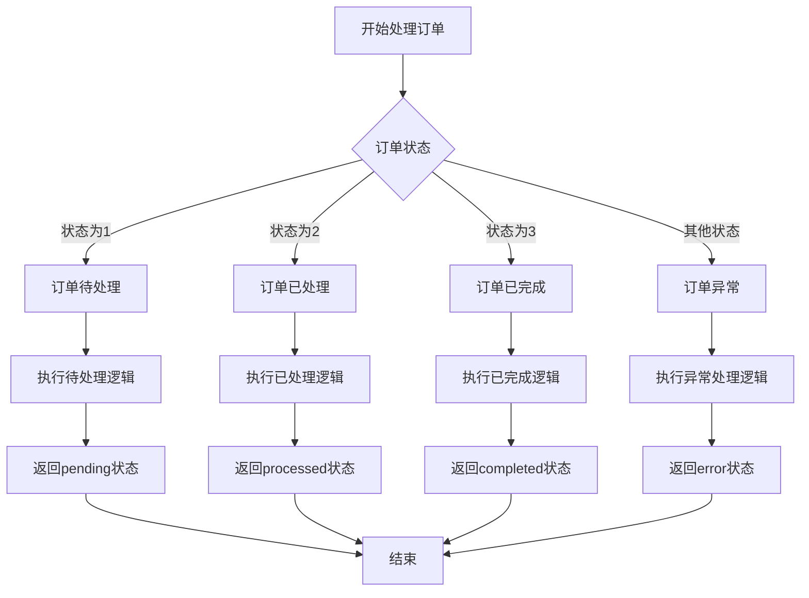

# 业务流程可视化器技能

## 概述

此技能接收一段包含复杂业务逻辑（如冗长的 if-else、switch-case、工单流转等）的代码片段，利用大模型将这些底层的“技术代码”翻译为非技术人员能看懂的“业务流程图”，并最终输出为 Mermaid 语法。

## 核心功能

- **代码分析**：分析包含复杂业务逻辑的代码片段
- **业务流程提取**：提取代码中的业务流程和决策点
- **可视化转换**：将业务流程转换为 Mermaid 流程图
- **非技术语言**：使用非技术语言描述业务流程
- **Markdown 输出**：以 Markdown 格式输出包含 Mermaid 图表的报告

## 工作流程

### 步骤 1：接收代码输入

用户提供包含复杂业务逻辑的代码片段。

### 步骤 2：分析代码

使用提供的脚本分析代码中的业务逻辑：

```bash
python /mnt/skills/public/business-flow-renderer/scripts/render.py \
  --code "def process_order(status):\n    if status == 1:\n        print('订单待处理')\n    elif status == 2:\n        print('订单已处理')\n    else:\n        print('订单异常')"
```

### 步骤 3：生成业务流程图

脚本会分析代码中的业务逻辑，提取决策点和流程步骤，生成 Mermaid 格式的业务流程图。

### 步骤 4：输出结果

生成的业务流程图将以 Markdown 格式输出，可以直接在对话中呈现或保存到文件。

## 参数

| 参数 | 是否必需 | 描述 |
|------|----------|------|
| `--code` | 是 | 包含业务逻辑的代码片段 |
| `--output` | 否 | 保存输出结果的路径 |

## 示例

### 订单处理流程示例

**输入：**
```python
def process_order(status):
    if status == 1:
        print('订单待处理')
        # 执行待处理逻辑
        return 'pending'
    elif status == 2:
        print('订单已处理')
        # 执行已处理逻辑
        return 'processed'
    elif status == 3:
        print('订单已完成')
        # 执行已完成逻辑
        return 'completed'
    else:
        print('订单异常')
        # 执行异常处理逻辑
        return 'error'
```

**命令：**
```bash
python /mnt/skills/public/business-flow-renderer/scripts/render.py \
  --code "def process_order(status):\n    if status == 1:\n        print('订单待处理')\n        # 执行待处理逻辑\n        return 'pending'\n    elif status == 2:\n        print('订单已处理')\n        # 执行已处理逻辑\n        return 'processed'\n    elif status == 3:\n        print('订单已完成')\n        # 执行已完成逻辑\n        return 'completed'\n    else:\n        print('订单异常')\n        # 执行异常处理逻辑\n        return 'error'"
```

**输出：**
```markdown
# 业务流程可视化报告

## 流程图



## 流程说明

此流程图展示了订单处理的业务流程，包含以下步骤：
1. 开始处理订单
2. 根据订单状态进行决策：
   - 状态为1：订单待处理，执行待处理逻辑，返回pending状态
   - 状态为2：订单已处理，执行已处理逻辑，返回processed状态
   - 状态为3：订单已完成，执行已完成逻辑，返回completed状态
   - 其他状态：订单异常，执行异常处理逻辑，返回error状态
3. 结束流程

## 注意事项

- 此流程图基于代码中的业务逻辑生成
- 流程图使用 Mermaid 语法，可以在支持 Mermaid 的 Markdown 编辑器中查看
- 流程中的决策点和步骤已转换为非技术语言，便于业务人员理解
```

## 文件输入示例

**命令：**
```bash
python /mnt/skills/public/business-flow-renderer/scripts/render.py \
  --file /mnt/user-data/uploads/business_logic.py \
  --output /mnt/user-data/outputs/flowchart.md
```

## 输出处理

- 对于简短的代码，直接在对话中呈现业务流程图
- 对于较长的代码，导出到 Markdown 文件并通过 `present_files` 工具分享
- 始终以 Markdown 格式输出，包含 Mermaid 图表和流程说明
- 使用非技术语言描述业务流程，便于业务人员理解

## 注意事项

- 业务流程提取的质量取决于代码的复杂度和清晰度
- 非常大的代码文件可能需要更长的处理时间
- 对于过于复杂的代码，生成的流程图可能会比较复杂
- 对于最佳结果，提供结构清晰、逻辑明确的代码
- 此技能依赖于大模型的能力，可能会因模型不同而产生不同的结果
