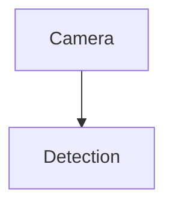

# Code Business DAG Analysis Pipeline

## 目标

把一段 Python 业务代码转换成可诊断的业务级 DAG，并生成三类输出：

1. 严格 JSON：包含 `pipeline_type`、`missing`、`anomalies` 三个诊断字段，以及每个技能步骤的中间产物。
2. 独立 Markdown 报告文件：报告必须输出为 `.md` 文件，不要把报告正文混在 JSON 里；JSON 只保留 `report_path`。
3. Mermaid 可视化图：报告里的业务 DAG 必须用 Mermaid 图块呈现，不要用 `A -> B`、`A → B` 这类文字箭头链路描述 DAG。

本技能是顺序编排技能，不替代各独立技能的实现。它的价值在于把前置技能产物固定串联，避免跳步、错序和输出契约不一致。

## 技能存在性确认

本流水线依赖的技能已经逐项确认存在：

| 顺序 | 技能名 | 位置 | 状态 |
| --- | --- | --- | --- |
| 1 | `code-to-ast-new` | `skills/public/code-to-ast-new` | 已存在 |
| 2 | `code-splitter-adapter` | `skills/public/code-splitter-adapter` | 已存在 |
| 3 | `dataflow-extractor` | `skills/public/dataflow-extractor` | 已存在 |
| 4 | `code-semantic-labeler` | `skills/public/code-semantic-labeler` | 已存在 |
| 5 | `pipeline-graph-builder` | `skills/public/pipeline-graph-builder` / `deerflow.pipeline.PipelineGraphBuilder` | 已存在 |
| 6 | `pipeline-reasoner` | `skills/public/pipeline-reasoner` / `deerflow.pipeline.CloudLLMReasoner` | 已存在 |

本技能提供 `scripts/run_pipeline.py` 作为联动入口，按上述顺序调用这些技能或其后端实现。

## 适用边界

- 只处理 Python 代码。若输入不是 Python，先返回失败 JSON，不进入后续步骤。
- 默认只做静态分析，不执行用户代码。
- 如果需要接入真实 `code-semantic-labeler`，实际集成时需要检查并修改其 `_init_llm` 中模型配置文件或客户端初始化的相对路径，确保从当前工作目录、技能目录或服务启动目录都能定位到配置。
- `pipeline-reasoner` 使用 `DeerFlow CloudLLMReasoner` 的本地图推理规则，不要求云端 API key。

## 固定执行顺序

严格按下面顺序执行，不要并行跳过依赖步骤：

1. `code-to-ast-new`
   - 解析 Python AST，提取函数、类、调用节点和可供后续分析的结构化节点。
   - 输出至少应能被后续 `dataflow-extractor` 或聚合适配器消费。

2. `code-splitter-adapter`
   - 仅启用 Python 分支。
   - 把原始代码拆成函数、类、模块级片段或更小的可分析 chunk。
   - 输出 `chunks: list`。

3. `dataflow-extractor`
   - 基于 AST 或 chunks 提取数据流关系。
   - 输出 `dataflow`，推荐形态为 `[[source, target], ...]` 或包含 `source`/`target` 字段的字典列表。

4. `code-semantic-labeler`
   - 对调用节点、关键函数、类和数据处理步骤进行业务语义标注。
   - 输出 `labeled_nodes: [{"name": "...", "type": "..."}, ...]`。
   - 集成注意：如果该技能内部有 `_init_llm`，需要把相对路径改为基于 `Path(__file__).resolve()`、显式配置路径或服务配置根目录解析，避免从不同 cwd 启动时找不到模型配置。

5. `pipeline-graph-builder`
   - 调用 `PipelineGraphBuilder.build_dag(calls, dataflow, labeled_nodes)`。
   - 输出业务级 DAG：`{"pipeline": {"nodes": [...], "edges": [[source, target], ...]}}`。

6. `pipeline-reasoner`
   - 把业务 DAG 转为 `networkx.DiGraph`。
   - 调用 `CloudLLMReasoner().reason(graph)`。
   - 输出严格 JSON 诊断字段：`pipeline_type`、`missing`、`anomalies`。

7. `analysis-report`
   - 基于原始输入、中间产物、业务 DAG 和诊断 JSON 生成独立中文 Markdown 报告文件。
   - 报告必须逐一解释每个技能产生的分析结果，不要列“步骤/状态”表。

8. `dag-visualization`
   - 最后必须在 Markdown 报告中生成业务 DAG Mermaid 图。
   - Mermaid 图必须使用 `pipeline.nodes` 和 `pipeline.edges`。
   - 报告正文不要再额外写一行文字箭头链路，例如不要写 `Storage → Camera → Detection → Tracking`。

## 推荐总输出 JSON

成功时返回：

```json
{
  "status": "success",
  "language": "python",
  "steps": [
    {"name": "code-to-ast-new", "status": "success"},
    {"name": "code-splitter-adapter", "status": "success"},
    {"name": "dataflow-extractor", "status": "success"},
    {"name": "code-semantic-labeler", "status": "success"},
    {"name": "pipeline-graph-builder", "status": "success"},
    {"name": "pipeline-reasoner", "status": "success"},
    {"name": "analysis-report", "status": "success"},
    {"name": "dag-visualization", "status": "success"}
  ],
  "chunks": [],
  "calls": [],
  "dataflow": [],
  "labeled_nodes": [],
  "pipeline": {
    "nodes": [],
    "edges": []
  },
  "diagnosis": {
    "pipeline_type": "unknown",
    "missing": [],
    "anomalies": []
  },
  "visualization": {
    "format": "mermaid",
    "rendered_in": "report"
  },
  "report_path": "outputs/code_business_dag_report.md",
  "report_format": "markdown"
}
```

失败时返回：

```json
{
  "status": "error",
  "failed_step": "code-semantic-labeler",
  "error": "具体错误信息",
  "language": "python",
  "steps": [
    {"name": "code-to-ast-new", "status": "success"},
    {"name": "code-splitter-adapter", "status": "success"},
    {"name": "dataflow-extractor", "status": "success"},
    {"name": "code-semantic-labeler", "status": "error"}
  ],
  "chunks": [],
  "calls": [],
  "dataflow": [],
  "labeled_nodes": [],
  "pipeline": {
    "nodes": [],
    "edges": []
  },
  "diagnosis": {
    "pipeline_type": "unknown",
    "missing": [],
    "anomalies": ["流水线未完成，无法进行完整业务诊断"]
  },
  "visualization": {
    "format": "mermaid",
    "rendered_in": "",
    "error": "无法生成 Mermaid DAG，因为流水线未完成"
  },
  "report_path": "",
  "report_format": "markdown"
}
```

## 长篇 Markdown 报告要求

报告必须作为独立 `.md` 文件输出，不要把报告正文放在 JSON 的 `report` 字段中。JSON 只允许记录 `report_path` 和 `report_format`。

报告必须使用中文 Markdown，内容要比简短摘要更完整。除非用户明确要求简化，否则报告应包含下列章节，并尽量写清楚每个结论的依据。

```markdown
# 代码业务 DAG 分析报告

## 1. 摘要

## 2. 输入代码概览

## 3. 各技能分析结果总览

## 4. code-to-ast-new 结果分析

## 5. code-splitter-adapter 结果分析

## 6. dataflow-extractor 数据流分析

## 7. code-semantic-labeler 语义标注分析

## 8. pipeline-graph-builder 业务 DAG 分析

## 9. pipeline-reasoner 诊断结果

## 10. 业务 DAG Mermaid 图

## 11. 缺失模块解释

## 12. 逻辑异常解释

## 13. 可信度、局限性与可能误判

## 14. 改进建议

## 15. 附录：关键 JSON 片段
```

### 每个技能结果必须覆盖

报告中必须逐一覆盖以下内容：

- `code-to-ast-new`：说明 AST 是否解析成功，识别到的主要函数、类、调用节点数量和典型调用。
- `code-splitter-adapter`：说明切分策略、chunk 数量、每个 chunk 的大致范围或用途。
- `dataflow-extractor`：说明数据从哪些变量、函数或模块流向哪些后续节点，并列出关键数据流边。
- `code-semantic-labeler`：说明每个关键代码节点被标注成什么业务类型，并指出 `Unknown` 或低置信标注。
- `pipeline-graph-builder`：说明业务 DAG 的节点、边、拓扑顺序、是否去重、是否存在被丢弃或合并的边。
- `pipeline-reasoner`：解释 `pipeline_type`、`missing`、`anomalies` 的判断依据。
- `dag-visualization`：在报告中给出 Mermaid 图块，且不要再用文字箭头链路复述 DAG。

### 报告写作要求

- 不要只罗列 JSON，要解释每个字段对业务流水线意味着什么。
- 对缺失模块要解释为什么缺失、可能造成什么影响、如何补齐。
- 对逻辑异常要说明异常来源、相关节点、严重程度和建议修复方向。
- 对数据流与调用图不一致的情况要单独说明。
- 对语义标注不确定的节点要标出，并说明可能的替代业务类型。
- 最后必须给出可执行的工程建议，按优先级排列。
- 不要在报告中列出“步骤/状态”表；报告应列“各技能分析结果”，例如 AST 结果、chunk 结果、数据流结果、语义标注结果、DAG 构图结果和 reasoner 诊断结果。

## Mermaid 可视化要求

最终一定要在 Markdown 报告中生成 Mermaid 图块。DAG 不要用普通文字箭头表示。

推荐格式：

````markdown

````

Mermaid 图内容要求：

- 标题：`Business DAG`
- 节点：使用 `pipeline.nodes`
- 边：使用 `pipeline.edges`
- 方向：从上游业务阶段指向下游业务阶段
- 缺失模块：如果能确定，可在 Mermaid 图或图后文字中说明。

## Python 集成骨架

当已有适配器对象时，优先复用 `deerflow.pipeline.DeerFlowOrchestrator` 完成前五步，再追加推理、独立 Markdown 报告和 Mermaid 可视化：

```python
import json
import networkx as nx

from deerflow.pipeline import CloudLLMReasoner, DeerFlowOrchestrator


def build_graph(pipeline):
    graph = nx.DiGraph()
    for node in pipeline.get("nodes", []):
        graph.add_node(node, type=node)
    for source, target in pipeline.get("edges", []):
        graph.add_edge(source, target)
    return graph


orchestrator = DeerFlowOrchestrator(
    code_splitter=code_splitter_adapter,
    ast_extractor=ast_and_dataflow_extractor,
    semantic_labeler=code_semantic_labeler,
)

analysis = orchestrator.process_raw_code(raw_code)
diagnosis = CloudLLMReasoner().reason(build_graph(analysis["pipeline"]))

result = {
    "status": "success",
    "language": "python",
    **analysis,
    "diagnosis": diagnosis,
}

print(json.dumps(result, ensure_ascii=False, indent=2))
```

## 可执行联动入口

如果需要直接从源码文件运行完整流水线，使用：

```powershell
python skills\public\code-business-dag-analysis-pipeline\scripts\run_pipeline.py `
  --file path\to\input.py `
  --output result.json `
  --report-output report.md
```

该脚本会：

1. 调用 `code-to-ast-new/scripts/convert.py` 的 Python AST 解析能力。
2. 调用 `code-splitter-adapter` 的 Python 切分器；若本地缺少 LangChain 切分依赖，会降级为单 chunk。
3. 调用 `dataflow-extractor` 的 AST 数据流分析。
4. 调用 `code-semantic-labeler` 的规则语义标注，并避免依赖不稳定 cwd。
5. 调用 `PipelineGraphBuilder.build_dag` 生成业务 DAG。
6. 调用 `CloudLLMReasoner().reason(graph)` 输出严格 JSON 诊断。
7. 生成更长、更清晰、更全面的独立中文 Markdown 报告。
8. 在报告中生成业务 DAG Mermaid 图，并把 `report_path` 写入 JSON 结果。

## 验证建议

修改提示词或文档后，至少检查：

```powershell
python skills\public\code-business-dag-analysis-pipeline\scripts\render_report.py --help
```

如果修改了实际代码实现，才需要运行：

```powershell
pytest backend\tests\test_pipeline_graph_builder.py backend\tests\test_pipeline_reasoner.py
```
