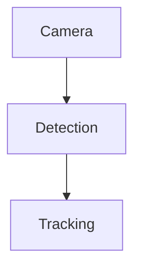

# Pipeline Graph Builder

## 目标

使用 `deerflow.pipeline.PipelineGraphBuilder` 把结构化代码关系和语义标签合成为业务 DAG，并在需要全链路时使用 `deerflow.pipeline.DeerFlowOrchestrator` 串联四个步骤：

1. `CodeSplitter`：切分原始代码。
2. `ASTExtractor`：提取 Call Graph 与 Dataflow。
3. `SemanticLabelingPipeline`：生成代码节点到业务类型的语义映射。
4. `PipelineGraphBuilder`：生成最终业务 DAG。

## 模块位置

生产模块位于：

```text
backend/packages/harness/deerflow/pipeline/
```

核心导入：

```python
from deerflow.pipeline import DeerFlowOrchestrator, PipelineGraphBuilder
```

## 快速使用

当已经拿到前置技能的联合输出时，直接调用 `PipelineGraphBuilder.build_dag`：

```python
from deerflow.pipeline import PipelineGraphBuilder

calls = [
    {"caller": "main", "callee": "cv2.VideoCapture"},
    {"caller": "main", "callee": "model.predict"},
]
dataflow = [["frame", "model.predict"], ["results", "tracker.update"]]
labeled_nodes = [
    {"name": "cv2.VideoCapture", "type": "Camera"},
    {"name": "model.predict", "type": "Detection"},
    {"name": "tracker.update", "type": "Tracking"},
]

pipeline = PipelineGraphBuilder().build_dag(calls, dataflow, labeled_nodes)
```

期望输出：

```python
{
    "pipeline": {
        "nodes": ["Camera", "Detection", "Tracking"],
        "edges": [["Camera", "Detection"], ["Detection", "Tracking"]],
    }
}
```

## 输入约定

`calls` 表示调用图边，优先支持：

```python
{"caller": "main", "callee": "model.predict"}
```

也兼容二元序列：

```python
["camera.open", "model.predict"]
```

`dataflow` 表示数据流边，优先支持：

```python
["frame", "model.predict"]
```

也兼容包含 `source`/`target`、`from`/`to`、`src`/`dst` 的字典。

`labeled_nodes` 必须是代码名称到业务类型的映射列表：

```python
{"name": "model.predict", "type": "Detection"}
```

## 构图规则

先把 `labeled_nodes` 转成查找表：

```text
代码名称 -> 业务 Type
```

再遍历 `calls` 和 `dataflow` 中的边，把边两端的代码名称转换为业务 Type。

默认策略是 `unknown_policy="drop"`：如果边的任一端无法映射到业务 Type，则丢弃该严格语义边。模块还会基于已识别业务节点的出现顺序补齐常见的变量中转链路，避免 `frame`、`results` 这类未标注变量破坏业务 pipeline 展示。

可选策略是：

```python
PipelineGraphBuilder(unknown_policy="unknown")
```

此时未标注节点会被归入 `"Unknown"`。

## NetworkX 行为

构建器使用 `nx.DiGraph()`：

- 重复边会由 `DiGraph` 自动去重。
- 自环通过 `nx.selfloop_edges(graph)` 查找并删除。
- 如果图中存在环，默认记录 warning，并删除检测到的环路末端边，直到满足 `nx.is_directed_acyclic_graph(graph)`。
- 节点导出优先使用 `nx.topological_sort(graph)`，保证业务节点按 DAG 拓扑顺序展示。

## 全链路编排

当需要从原始代码运行到业务 DAG 时，使用 `DeerFlowOrchestrator`，并注入前置技能适配器：

```python
from deerflow.pipeline import DeerFlowOrchestrator

orchestrator = DeerFlowOrchestrator(
    code_splitter=code_splitter,
    ast_extractor=ast_extractor,
    semantic_labeler=semantic_labeler,
)

result = orchestrator.process_raw_code(raw_code)
pipeline = result["pipeline"]
```

适配器最低要求：

```python
class CodeSplitter:
    def split(self, raw_code: str) -> list: ...

class ASTExtractor:
    def extract(self, chunks: list) -> dict: ...

class SemanticLabelingPipeline:
    def label(self, *args, **kwargs) -> list[dict]: ...
```

`process_raw_code` 返回中间产物和最终 DAG：

```python
{
    "chunks": [...],
    "calls": [...],
    "dataflow": [...],
    "labeled_nodes": [...],
    "pipeline": {
        "nodes": [...],
        "edges": [...],
    },
}
```

## 展示建议

对外展示时优先展示 `result["pipeline"]`，不要把未标注变量节点作为业务节点展示。

推荐说明口径：

```text
该 DAG 表示业务组件之间的依赖关系，而不是逐行代码调用关系。
节点来自 Semantic Labels 的 type 字段，边来自 Call Graph 与 Dataflow 的融合结果。
```

当用户要求可视化时，可以把输出转换为 Mermaid：



## 验证

修改模块后至少运行：

```powershell
pytest backend\tests\test_pipeline_graph_builder.py
```

如果环境安装了 `ruff`，再运行：

```powershell
ruff check backend\packages\harness\deerflow\pipeline backend\tests\test_pipeline_graph_builder.py
```
